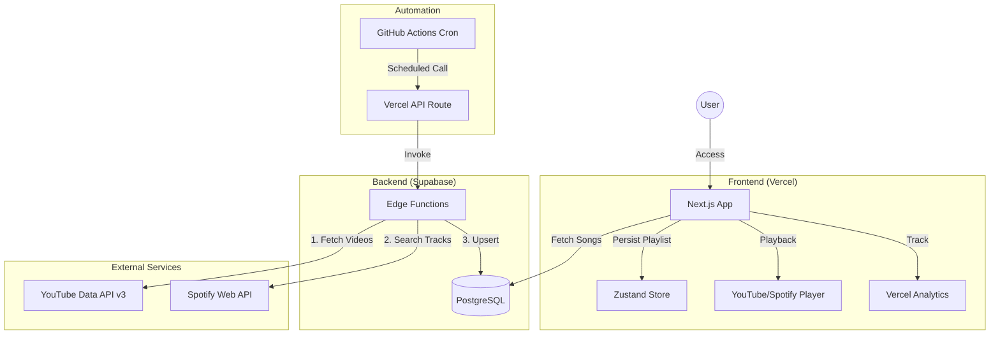

# 推しが歌ってた

[](https://oshiga-utatteta.vercel.app)

Vtuberがカバーした楽曲を一覧表示し、YouTubeとSpotifyで聴き比べられるWebアプリケーション

**Demo:** <https://oshiga-utatteta.vercel.app>

---

## 機能

- 一覧表示（カード形式、サムネイル・Vtuber名・曲名・アーティスト名・公開日）
- リアルタイム検索（Vtuber名・曲名・アーティスト名で絞り込み）
- 詳細ページ（YouTube埋め込み再生 + Spotify埋め込み再生）
- プレイリスト（Zustand + localStorage永続化、連続再生）
- Xシェアボタン
- 自動楽曲取得（GitHub Actions Cron → Vercel API Route → Supabase）

---

## 技術スタック

| レイヤー | 技術 |
|---------|------|
| フロントエンド | Next.js 16 (App Router), React 19, TypeScript |
| スタイリング | Vanilla CSS |
| 状態管理 | Zustand (persist) |
| データベース | Supabase (PostgreSQL, RLS) |
| Edge Functions | Supabase Edge Functions (Deno) |
| デプロイ | Vercel |
| アナリティクス | Vercel Analytics |
| CI/CD | GitHub Actions (Cron) |
| 外部API | YouTube Data API v3, Spotify Web API |

---

## システム構成図



---

## プロジェクト構成

```
oshiga-utatteta/
├── app/
│   ├── layout.tsx              # ルートレイアウト
│   ├── page.tsx                # ホームページ（一覧・検索）
│   ├── page.css
│   ├── globals.css             # グローバルCSS
│   ├── api/
│   │   └── cron/
│   │       └── fetch-cover-songs/
│   │           └── route.ts    # Cron API Route
│   ├── cover/
│   │   └── [id]/
│   │       ├── page.tsx        # 詳細ページ
│   │       └── page.css
│   └── playlist/
│       ├── page.tsx            # プレイリストページ
│       └── page.css
├── components/
│   ├── Header.tsx / .css
│   ├── CoverSongCard.tsx / .css
│   ├── SearchBar.tsx / .css
│   ├── YouTubePlayer.tsx / .css
│   ├── SpotifyPlayer.tsx / .css
│   └── Providers.tsx
├── lib/
│   ├── supabase.ts             # Supabaseクライアント
│   ├── store.ts                # Zustand Store（プレイリスト）
│   └── api-types.ts            # API型定義
├── types/
│   └── index.ts                # 共通型定義
├── scripts/
│   ├── initial-fetch.ts        # 初回データ取得スクリプト
│   ├── backfill-spotify.ts     # Spotifyデータ補完
│   ├── check-unwanted-songs.ts # 不要データチェック
│   ├── test-parser.ts          # パーサーテスト
│   └── ...
├── supabase/
│   └── functions/
│       └── fetch-cover-songs/  # Edge Function
│           ├── index.ts
│           └── _shared/
│               ├── parser.ts   # タイトル解析ロジック
│               ├── youtube.ts  # YouTube APIクライアント
│               └── spotify.ts  # Spotify APIクライアント
├── .github/
│   └── workflows/
│       └── fetch-songs.yml     # GitHub Actions Cron
├── .env.local                  # 環境変数
└── package.json
```

---

## セットアップ

### 必要な環境

- Node.js 18以上
- Supabaseプロジェクト
- YouTube Data API v3キー
- Spotify APIクレデンシャル

### インストールと起動

```bash
npm install
npm run dev
```

### 環境変数（.env.local）

```env
# Supabase
NEXT_PUBLIC_SUPABASE_URL=https://xxxxx.supabase.co
NEXT_PUBLIC_SUPABASE_ANON_KEY=eyJ...
SUPABASE_SERVICE_ROLE_KEY=sb_secret_...

# YouTube Data API
YOUTUBE_API_KEY=AIza...

# Spotify API
SPOTIFY_CLIENT_ID=xxxxx
SPOTIFY_CLIENT_SECRET=xxxxx

# Vercel Cron認証
CRON_SECRET=xxxxx
```

---

## データ取得の仕組み

### 自動取得（定期実行）

GitHub Actionsが1日4回（日本時間 9:00, 19:00, 21:00, 23:00）Vercel API Routeを呼び出し、各チャンネルの新着動画を取得する。

### 初回取得（手動）

```bash
# 全チャンネルの過去1年分を取得
npx tsx scripts/initial-fetch.ts 365

# 特定チャンネルのみ取得
npx tsx scripts/initial-fetch.ts 365 <channel_id>
```

### タイトル解析（パーサー）

動画タイトルから曲名・アーティスト名を正規表現で抽出する。対応パターン:

- `【歌ってみた】曲名 / アーティスト名`
- `曲名 - アーティスト cover`
- `【カバー】曲名（アーティスト名）`
- チャンネル固有ロジック（KMNZ、トゲナシトゲアリ）

---

## デプロイ

1. GitHubにpush（mainブランチ）
2. Vercelが自動デプロイ
3. Vercelダッシュボードで環境変数を設定

---

## デザインシステム

| 項目 | 値 |
|------|-----|
| プライマリカラー | `#FF6B9D` (ピンク) |
| セカンダリカラー | `#C56BFF` (紫) |
| アクセントカラー | `#FFD93D` (イエロー) |
| 見出しフォント | Inter |
| 本文フォント | Noto Sans JP |
