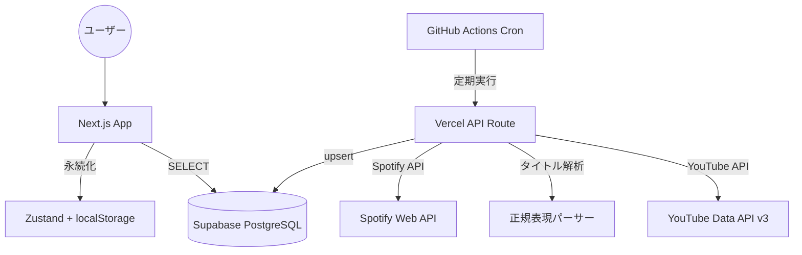

# 「推しが歌ってた」処理概要

推しのアーティストがカバーした楽曲を自動収集し、YouTubeとSpotifyで聴き比べられるWebアプリ。

**Demo:** <https://oshiga-utatteta.vercel.app>

---

## 技術スタック

| レイヤー | 技術 |
|---------|------|
| フロントエンド | Next.js 16 (App Router), React 19, TypeScript |
| スタイリング | Vanilla CSS |
| 状態管理 | Zustand (persist → localStorage) |
| DB | Supabase (PostgreSQL, RLS) |
| 自動化 | GitHub Actions (Cron) → Vercel API Route |
| 外部API | YouTube Data API v3, Spotify Web API |
| デプロイ | Vercel (GitHub連携で自動デプロイ) |

---

## アーキテクチャ



---

## 処理フロー

### 1. 楽曲の自動収集（バッチ処理）

GitHub Actionsが1日4回（JST 9:00, 19:00, 21:00, 23:00）Vercel API Routeを呼び出す。

```
GitHub Actions (Cron)
  ↓ Bearer Token認証
Vercel API Route (Edge Runtime)
  ↓
① monitored_channels テーブルから監視対象チャンネル一覧を取得
  ↓
② 各チャンネルの最新動画を YouTube Data API で取得
   - search.list → videos.list で詳細取得
   - Shorts（60秒以下）を除外
  ↓
③ 動画タイトルを正規表現で解析し、曲名・アーティスト名を抽出
  ↓
④ Spotify Web API で原曲を検索・マッチング
   - Client Credentials Flow でトークン取得
   - track: / artist: クエリで検索
  ↓
⑤ Supabase に upsert（youtube_video_id をコンフリクトキーに）
```

### 2. タイトル解析（パーサー）

動画タイトルから曲名とアーティスト名を抽出する。8パターンの正規表現で対応。

| パターン | 例 |
|---------|-----|
| `【歌ってみた】曲名 / アーティスト` | 最も一般的 |
| `曲名 / アーティスト【歌ってみた】` | 逆配置 |
| `曲名 - アーティスト cover` | 英語系 |
| `【カバー】曲名（アーティスト名）` | 括弧系 |
| `曲名（アーティスト名）【歌ってみた】` | 括弧＋タグ |
| `【歌ってみた】曲名【チャンネル名】` | description参照 |
| `曲名 / アーティスト` | 区切り文字のみ |
| `チャンネル名『曲名』Cover` | 二重括弧系 |

チャンネル名が曲名位置に来た場合は自動でスワップする処理も実装。

### 3. フロントエンド表示

```
/ (ホーム)
  ├─ Supabase から全カバー曲を取得 (published_at DESC)
  ├─ リアルタイム検索（チャンネル名・曲名・アーティスト名）
  └─ カード形式で一覧表示

/cover/[id] (詳細)
  ├─ YouTube埋め込みプレイヤー（カバー動画）
  ├─ Spotify埋め込みプレイヤー（原曲）
  └─ Xシェアボタン

/playlist (プレイリスト)
  ├─ Zustand + localStorage で永続化
  ├─ 連続再生（前へ/次へ）
  └─ 追加/削除/クリア
```

### 4. データベース設計

主要テーブルは2つ。

**cover_songs**: カバー曲データ本体

- `youtube_video_id` (UNIQUE): YouTube動画ID
- `vtuber_name`: チャンネル名
- `song_title` / `artist_name`: 解析結果
- `spotify_track_id` / `spotify_track_url`: Spotify情報（nullable）

**monitored_channels**: 監視対象チャンネル

- `channel_id` (UNIQUE): YouTubeチャンネルID
- `is_active`: 有効/無効フラグ

RLSポリシーで `SELECT` は公開、書き込みはサービスキーのみに制限。

---

## YouTube API クォータ管理

- 無料枠: 1日10,000ユニット
- search.list: 100ユニット / リクエスト
- videos.list: 1ユニット / リクエスト
- 監視チャンネル数を10〜20に制限して運用
