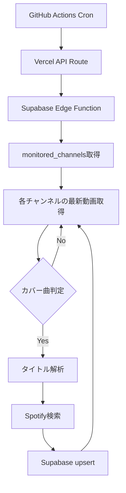

# 「推しが歌ってた」要件定義書

## プロジェクト概要

**アプリ名**: 推しが歌ってた

**コンセプト**: 推しのアーティストがYouTubeでカバーした楽曲を一覧表示し、クリックするだけでYouTube動画と原曲のSpotifyプレイヤーを視聴できるWebアプリケーション

**ターゲット**: カバー曲好き、カジュアルな音楽リスナー

**URL**: <https://oshiga-utatteta.vercel.app>

---

## 実装済み機能

### 1. 一覧表示

- カバー曲の一覧をカード形式で表示
- 各カードにサムネイル、チャンネル名、曲名、アーティスト名、公開日を表示
- Spotify連携済みの曲にはバッジを表示

### 2. リアルタイム検索

- チャンネル名・曲名・アーティスト名で絞り込み
- 入力しながらリアルタイムにフィルタリング
- 検索結果件数の表示

### 3. 詳細ページ

- YouTube埋め込みプレイヤーでカバー動画を再生
- Spotify埋め込みプレイヤーで原曲を再生
- Spotify未連携の場合はSpotify検索リンクを表示
- Xシェアボタン

### 4. プレイリスト

- カバー曲をプレイリストに追加/削除
- Zustand + localStorage でブラウザに永続化
- プレイリストページで連続再生（前へ/次へ）

### 5. 自動データ取得

- GitHub Actions Cronが1日4回（JST 9:00, 19:00, 21:00, 23:00）実行
- Vercel API Route → Supabase Edge Function の呼び出しチェーン
- YouTube Data API で新着動画を取得
- タイトル解析（正規表現）で曲名・アーティスト名を抽出
- Spotify Web API で原曲をマッチング
- Supabaseに upsert

### 6. チャンネル固有パーサー

- KMNZ: オリジナル曲のフォールバック処理
- トゲナシトゲアリ: MV/ライブ映像/Shortsの曲名抽出、非音楽コンテンツの除外

---

## 技術スタック

### フロントエンド

- **フレームワーク**: Next.js 16 (App Router)
- **言語**: TypeScript
- **ランタイム**: React 19
- **スタイリング**: Vanilla CSS
- **状態管理**: Zustand (persist middleware, localStorage)

### バックエンド

- **BaaS**: Supabase
  - PostgreSQL データベース
  - Edge Functions (Deno)
  - Row Level Security

### 自動化

- **定期実行**: GitHub Actions (Cron)
- **API Route**: Vercel (Next.js API Route, edge runtime)

### デプロイ

- **ホスティング**: Vercel (GitHub連携で自動デプロイ)

### 外部API

- **YouTube Data API v3**: カバー曲動画の取得
- **Spotify Web API**: 原曲情報の取得とマッチング

---

## データベース設計

### テーブル構成

#### 1. `cover_songs`

| カラム名 | 型 | 説明 |
|---------|-----|------|
| id | uuid | 主キー |
| youtube_video_id | text | YouTube動画ID (UNIQUE) |
| vtuber_name | text | チャンネル名 |
| channel_id | text | YouTubeチャンネルID |
| video_title | text | YouTube動画タイトル |
| thumbnail_url | text | サムネイルURL |
| published_at | timestamp | 公開日時 |
| song_title | text | 楽曲名 |
| artist_name | text | 原曲アーティスト名 |
| spotify_track_id | text | Spotify Track ID (nullable) |
| spotify_track_url | text | Spotify URL (nullable) |
| created_at | timestamp | レコード作成日時 |
| updated_at | timestamp | レコード更新日時 |

#### 2. `monitored_channels`

| カラム名 | 型 | 説明 |
|---------|-----|------|
| id | uuid | 主キー |
| channel_id | text | YouTubeチャンネルID (UNIQUE) |
| channel_name | text | チャンネル名 |
| is_active | boolean | 監視中フラグ |
| created_at | timestamp | レコード作成日時 |

#### 3. `user_favorites`（未使用・将来拡張用）

| カラム名 | 型 | 説明 |
|---------|-----|------|
| id | uuid | 主キー |
| user_id | uuid | ユーザーID |
| cover_song_id | uuid | カバー曲ID (FK) |
| created_at | timestamp | 登録日時 |

### RLSポリシー

- `cover_songs`: 誰でも SELECT 可能。INSERT/UPDATE/DELETE はサービスキーのみ
- `monitored_channels`: 誰でも SELECT 可能。変更はサービスキーのみ

---

## バッチ処理設計

### 実行フロー

### カバー曲判定キーワード

`歌ってみた`, `カバー`, `COVER`, `cover`, `Cover`

### タイトル解析パターン（主要）

1. `【歌ってみた】曲名 / アーティスト名`
2. `曲名 covered by チャンネル名`
3. `曲名 / アーティスト名 Cover`
4. `【カバー】曲名（アーティスト名）`
5. チャンネル固有: KMNZ / トゲナシトゲアリ

### YouTube Data API クォータ

- 無料枠: 1日10,000ユニット
- 1チャンネルあたり約100ユニット
- 監視チャンネル数は10〜20に制限して運用

---

## 既知の制約

- Spotifyマッチング精度は動画タイトルのフォーマットに依存（100%は困難）
- YouTube/Spotify埋め込みプレイヤーは各サービスの利用規約に準拠
- 動画・楽曲の著作権は各権利者に帰属
