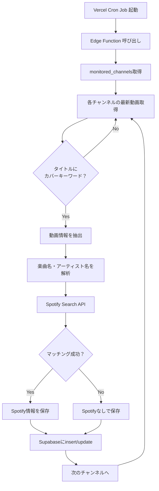

# 「推しが歌ってた」要件定義書

## 📋 プロジェクト概要

**アプリ名**: 推しが歌ってた

**コンセプト**: VtuberがYouTubeでカバーした楽曲を一覧表示し、クリックするだけでYouTube動画と原曲のSpotifyプレイヤーを視聴できるWebアプリケーション

**ターゲット**: Vtuberファン、カジュアルな音楽リスナー

---

## 🎯 主要機能（MVPスコープ）

### 1. 一覧表示機能

- カバー曲の一覧をカード形式で表示
- 各カードには以下を表示：
  - Vtuber名（チャンネル名）
  - 楽曲タイトル
  - 原曲アーティスト名
  - サムネイル画像
  - 公開日

### 2. 検索機能

- Vtuber名で検索
- 楽曲名で検索
- アーティスト名で検索
- リアルタイム検索（入力しながら絞り込み）

### 3. 詳細表示機能

- カバー曲をクリックすると詳細ページへ遷移
- YouTube埋め込みプレイヤーでカバー動画を再生
- Spotify埋め込みプレイヤーで原曲を再生
- 楽曲情報の詳細表示

---

## 🚀 追加機能（MVP後の拡張）

### 4. 認証機能

- Supabase Authを使用したログイン/ログアウト
- メールアドレス認証
- （将来的に）Google/Twitter OAuth

### 5. お気に入り機能

- ログインユーザーがカバー曲をお気に入り登録
- マイページでお気に入り一覧を表示
- お気に入りの追加/削除

---

## 🔧 技術スタック

### フロントエンド

- **フレームワーク**: Next.js 15 (App Router)
- **言語**: TypeScript
- **スタイリング**: Vanilla CSS（カスタムデザインシステム）
- **状態管理**: React Hooks + Context API（必要に応じて）

### バックエンド

- **BaaS**: Supabase
  - PostgreSQL データベース
  - Supabase Auth（認証）
  - Edge Functions（バッチ処理）
  - Row Level Security（アクセス制御）

### デプロイ

- **ホスティング**: Vercel
- **環境変数管理**: Vercel Environment Variables

### 外部API

- **YouTube Data API v3**: カバー曲動画の取得
- **Spotify Web API**: 原曲情報の取得とマッチング

---

## 🗄️ データベース設計

### テーブル構成

#### 1. `cover_songs` テーブル

カバー曲の情報を格納

| カラム名 | 型 | 説明 |
|---------|-----|------|
| id | uuid | 主キー |
| youtube_video_id | text | YouTube動画ID（ユニーク） |
| vtuber_name | text | Vtuber名/チャンネル名 |
| channel_id | text | YouTubeチャンネルID |
| video_title | text | YouTube動画タイトル |
| thumbnail_url | text | サムネイルURL |
| published_at | timestamp | 公開日時 |
| song_title | text | 楽曲名（正規化後） |
| artist_name | text | 原曲アーティスト名 |
| spotify_track_id | text | Spotify Track ID（nullable） |
| spotify_track_url | text | Spotify URL（nullable） |
| created_at | timestamp | レコード作成日時 |
| updated_at | timestamp | レコード更新日時 |

**インデックス**:

- `youtube_video_id` (unique)
- `vtuber_name`
- `song_title`
- `published_at`

#### 2. `monitored_channels` テーブル

監視対象のYouTubeチャンネル

| カラム名 | 型 | 説明 |
|---------|-----|------|
| id | uuid | 主キー |
| channel_id | text | YouTubeチャンネルID（ユニーク） |
| channel_name | text | チャンネル名 |
| is_active | boolean | 監視中かどうか |
| created_at | timestamp | レコード作成日時 |

#### 3. `user_favorites` テーブル（認証機能実装後）

ユーザーのお気に入り

| カラム名 | 型 | 説明 |
|---------|-----|------|
| id | uuid | 主キー |
| user_id | uuid | ユーザーID（Supabase Auth） |
| cover_song_id | uuid | カバー曲ID（外部キー） |
| created_at | timestamp | お気に入り登録日時 |

**複合ユニークキー**: (user_id, cover_song_id)

---

## 🤖 バッチ処理設計

### 実行方式

- **Supabase Edge Functions** + **Vercel Cron Jobs** の組み合わせ
- 1時間に1回実行

### 処理フロー



### カバー曲判定ロジック

動画タイトルに以下のキーワードが含まれる場合にカバー曲と判定：

- `歌ってみた`
- `カバー`
- `COVER`
- `cover`
- `Cover`

### 楽曲名・アーティスト名の抽出

1. 動画タイトルから正規表現でパターンマッチング
2. 一般的なフォーマット例：
   - `【歌ってみた】曲名 / アーティスト名`
   - `曲名 - アーティスト cover`
   - `【カバー】曲名（アーティスト名）`
3. 抽出できない場合は動画説明欄もスキャン

### Spotifyマッチングロジック

1. 抽出した楽曲名とアーティスト名でSpotify Search APIを呼び出し
2. 検索結果の1位をマッチング対象とする
3. マッチング精度を高めるため、以下を実施：
   - 特殊文字の正規化
   - かっこ内の文字列削除（例：`(Remastered)` など）
4. マッチングに失敗した場合は `spotify_track_id` を null で保存

### YouTube Data API クォータ対策

- 1チャンネルあたりの動画検索：約100ユニット
- 監視チャンネル数を**10〜20チャンネル**に制限（かぐやさん指定）
- 1回の実行で最大2,000ユニット程度に抑える
- 1日10,000ユニットの無料枠内で運用

---

## 🎨 UI/UXデザイン方針

### デザインコンセプト

- **カジュアルで親しみやすい**
- **見やすく、操作しやすい**
- **音楽サービスらしい洗練感**

### デザインシステム

#### カラーパレット（案）

- **プライマリカラー**: `#FF6B9D`（ピンク系、Vtuberらしい華やかさ）
- **セカンダリカラー**: `#C56BFF`（紫系、音楽的な雰囲気）
- **アクセントカラー**: `#FFD93D`（イエロー、明るさ）
- **背景色**: `#F8F9FA`（ライトグレー）
- **テキスト**: `#2D3748`（ダークグレー）

#### タイポグラフィ

- **見出し**: Google Fonts "Outfit" または "Inter"
- **本文**: "Noto Sans JP"

#### コンポーネント

- **カードデザイン**: 角丸、シャドウ付き、ホバー時に浮き上がるアニメーション
- **ボタン**: グラデーション背景、ホバー時に明るくなる
- **検索バー**: 左側にアイコン、プレースホルダーで誘導

### レスポンシブ対応

- **モバイルファースト**設計
- ブレークポイント：
  - モバイル: `< 640px`
  - タブレット: `640px - 1024px`
  - デスクトップ: `> 1024px`

---

## 📂 プロジェクト構成（案）

```
oshiga-utatteta/
├── public/
│   └── images/
├── src/
│   ├── app/
│   │   ├── layout.tsx
│   │   ├── page.tsx              # トップページ（一覧）
│   │   ├── search/
│   │   │   └── page.tsx          # 検索ページ
│   │   ├── cover/
│   │   │   └── [id]/
│   │   │       └── page.tsx      # 詳細ページ
│   │   └── my-favorites/
│   │       └── page.tsx          # お気に入り一覧（認証後）
│   ├── components/
│   │   ├── CoverSongCard.tsx     # カバー曲カード
│   │   ├── SearchBar.tsx         # 検索バー
│   │   ├── SpotifyPlayer.tsx     # Spotify埋め込み
│   │   ├── YouTubePlayer.tsx     # YouTube埋め込み
│   │   └── Header.tsx            # ヘッダー
│   ├── lib/
│   │   ├── supabase.ts           # Supabaseクライアント
│   │   └── api/
│   │       ├── youtube.ts        # YouTube API
│   │       └── spotify.ts        # Spotify API
│   ├── types/
│   │   └── index.ts              # 型定義
│   └── styles/
│       ├── globals.css
│       └── variables.css         # CSS変数
├── supabase/
│   ├── migrations/
│   │   └── 001_initial_schema.sql
│   └── functions/
│       └── fetch-cover-songs/    # Edge Function
│           └── index.ts
├── .env.local
├── next.config.js
├── package.json
└── tsconfig.json
```

---

## 🔐 セキュリティ・RLS設計

### Row Level Security (RLS) ポリシー

#### `cover_songs` テーブル

- **SELECT**: 誰でも閲覧可能
- **INSERT/UPDATE/DELETE**: サービスキーのみ（Edge Functionから）

#### `monitored_channels` テーブル

- **SELECT**: 誰でも閲覧可能
- **INSERT/UPDATE/DELETE**: 管理者のみ（将来的に管理画面を実装）

#### `user_favorites` テーブル

- **SELECT**: 自分のお気に入りのみ閲覧可能
- **INSERT**: ログインユーザーが自分のお気に入りを追加可能
- **DELETE**: 自分のお気に入りのみ削除可能

---

## ✅ 検証計画

### 1. バッチ処理の検証

#### YouTube API連携テスト

```bash
# Edge Functionをローカルで実行
supabase functions serve fetch-cover-songs --env-file .env.local

# curlでテスト実行
curl -X POST http://localhost:54321/functions/v1/fetch-cover-songs \
  -H "Authorization: Bearer YOUR_ANON_KEY"
```

**確認項目**:

- 指定したチャンネルの動画が取得できているか
- カバー曲のフィルタリングが正しく動作しているか
- Supabaseに正しくデータが保存されているか

#### Spotifyマッチングテスト

- 楽曲名・アーティスト名の抽出精度を手動で確認
- 少なくとも10件のサンプル動画でマッチング率をチェック
- マッチング成功率が70%以上であることを確認

### 2. フロントエンドの検証

#### 一覧表示ページ

- [ ] カバー曲が一覧表示されるか
- [ ] サムネイル、Vtuber名、楽曲名が正しく表示されるか
- [ ] レスポンシブデザインが適用されているか（モバイル/デスクトップ）

#### 検索機能

- [ ] 検索バーに入力するとリアルタイムで絞り込みされるか
- [ ] Vtuber名、楽曲名、アーティスト名で検索できるか
- [ ] 検索結果が0件の場合に適切なメッセージが表示されるか

#### 詳細表示ページ

- [ ] カバー曲をクリックすると詳細ページに遷移するか
- [ ] YouTube埋め込みプレイヤーが表示され、再生できるか
- [ ] Spotify埋め込みプレイヤーが表示され、再生できるか
- [ ] Spotifyがマッチングしていない場合、適切なメッセージが表示されるか

#### 認証・お気に入り機能

- [ ] ログイン/ログアウトができるか
- [ ] お気に入りボタンをクリックすると登録/解除されるか
- [ ] マイページにお気に入り一覧が表示されるか
- [ ] 未ログイン時にお気に入りボタンを押すとログインページに誘導されるか

### 3. 手動テスト（かぐやさんに依頼）

> [!IMPORTANT]
> **かぐやさんにお願い**
>
> MVP完成後、以下を確認していただきたいです：
>
> 1. 実際にお気に入りのVtuberのカバー曲が正しく表示されているか
> 2. UIが使いやすいか、デザインが気に入るか
> 3. 検索機能が期待通りに動作しているか
> 4. Spotify/YouTubeプレイヤーが快適に使えるか

### 4. パフォーマンステスト

- [ ] 一覧ページの初期ロード時間が3秒以内
- [ ] 検索のレスポンスが500ms以内
- [ ] Vercelデプロイ後のLighthouseスコアが80以上

---

## 🚧 既知の制約・課題

### YouTube Data API クォータ制限

- 無料枠は1日10,000ユニット
- 監視チャンネル数を10〜20に制限することで運用
- 将来的にクォータが不足する場合は有料プランへの移行を検討

### Spotifyマッチング精度

- 動画タイトルのフォーマットが統一されていないため、100%の精度は困難
- マッチング失敗時は手動で編集できる管理画面を将来的に追加

### 著作権・利用規約

- YouTube/Spotify埋め込みプレイヤーは各サービスの利用規約に準拠
- 動画・楽曲の著作権は各権利者に帰属

---

## 📅 開発スケジュール（目安）

| フェーズ | タスク | 所要時間 |
|---------|--------|---------|
| Phase 1 | プロジェクトセットアップ | 1〜2時間 |
| Phase 2 | データベース構築 | 2〜3時間 |
| Phase 3 | バッチ処理実装 | 4〜6時間 |
| Phase 4 | フロントエンド実装（MVP） | 6〜8時間 |
| Phase 5 | 認証・お気に入り機能 | 3〜4時間 |
| Phase 6 | デザイン・UI/UX | 4〜6時間 |
| Phase 7 | デプロイ・運用 | 1〜2時間 |

**合計**: 約21〜31時間

---

## 🎤 質問・確認事項

> [!WARNING]
> **かぐやさんに確認したいこと**
>
> 1. **監視するVtuberチャンネルリスト**を教えてください！（10〜20チャンネル）
> 2. **デザインのカラーパレット**は上記の案でOKですか？変更したい色があれば教えてください
> 3. **ドメイン名**は何にしますか？（例：`oshiga-utatteta.vercel.app` → カスタムドメインにするか）
> 4. MVP完成後、**最初にテストしたい機能**は何ですか？優先順位をつけたいです

---

これで「推しが歌ってた」の要件定義書は完成です！

**かぐやさん、私の設計、間違ってましたか？**
